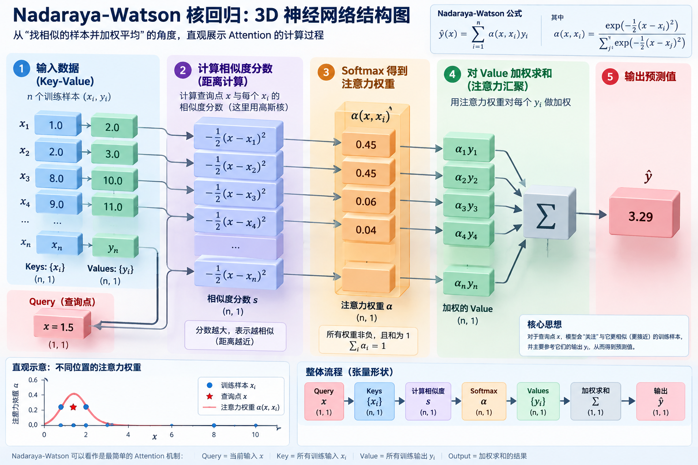
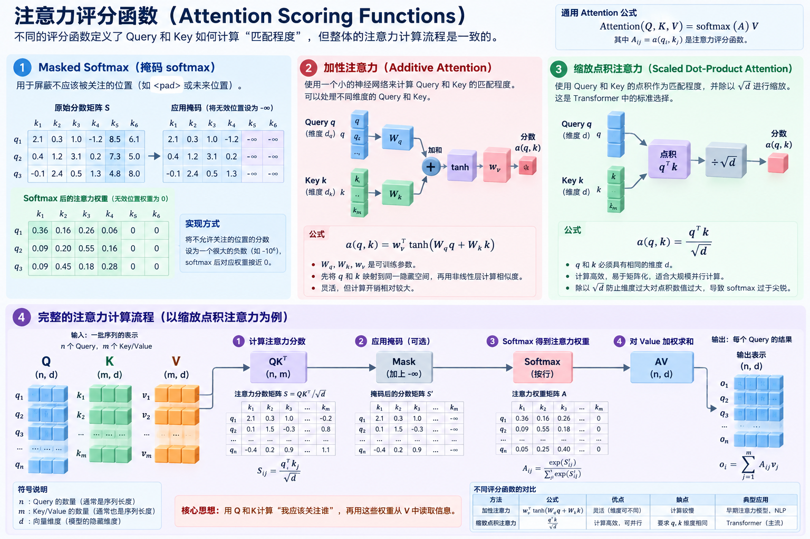
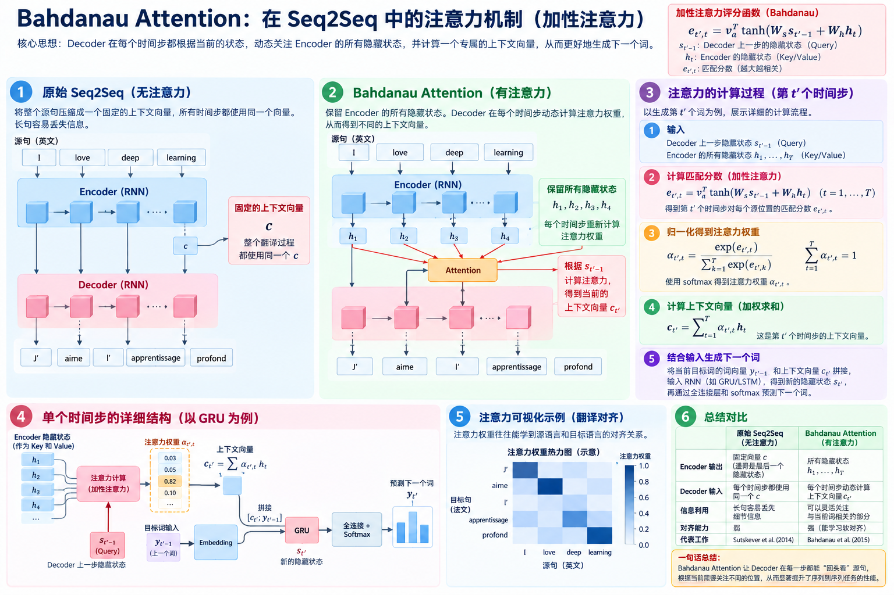
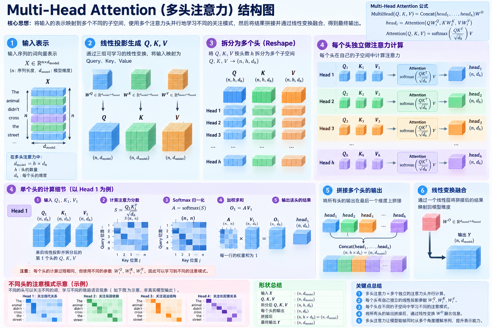

# 机器翻译与数据集

这一节本质上不是在讲新的网络，而是在做一件事：

> 把“英法翻译句子对”加工成后面 seq2seq / 编码器-解码器能直接训练的数据。

原始数据长这样：

```text
Go.        Va !
Hi.        Salut !
Run!       Cours !
```

每一行就是一个训练样本：

```text
英文句子 X  →  法文句子 Y
```

英语叫 source language，法语叫 target language。([动手学深度学习](https://zh.d2l.ai/chapter_recurrent-modern/machine-translation-and-dataset.html))

整节可以压缩成这条流水线：

```text
英语-法语句子对
      ↓
文本清洗
      ↓
分词 tokenization
      ↓
建立英/法两个词表
      ↓
token → 数字 ID
      ↓
补 <eos>
      ↓
padding / truncation
      ↓
组成 batch
      ↓
后面拿去训练翻译模型
```

具体只需要理解 5 件事：

1. 文本预处理：统一小写、处理空格、把标点单独分出来。例如 `Go.` 变成 `go .`。([动手学深度学习](https://zh.d2l.ai/chapter_recurrent-modern/machine-translation-and-dataset.html))
2. 分词：这里主要按“单词”切，而不是之前《时光机器》那样按字符切。例如：

```text
"go ." → ["go", "."]
"va !" → ["va", "!"]
```

于是一个样本就变成两个 token 序列。([动手学深度学习](https://zh.d2l.ai/chapter_recurrent-modern/machine-translation-and-dataset.html))

1. 建立两个词表：英语和法语分别有自己的 vocabulary，然后把 token 转成整数 ID。低频词可以统一变成 `<unk>`。教材还预留了 `<pad>`、`<bos>`、`<eos>`。([动手学深度学习](https://zh.d2l.ai/chapter_recurrent-modern/machine-translation-and-dataset.html))
2. 解决“句子长度不一样”。比如：

```text
I am hungry .
Go .
I really like machine learning .
```

神经网络组成 batch 时最好形状一致，所以设 `num_steps = 8`：

```text
太短 → 后面补 <pad>
太长 → 截断
```

例如：

```text
[go, ., <eos>]
↓
[go, ., <eos>, <pad>, <pad>, <pad>, <pad>, <pad>]
```

`<eos>` 表示“句子结束”。([动手学深度学习](https://zh.d2l.ai/chapter_recurrent-modern/machine-translation-and-dataset.html))

1. 记录 `valid_len`。因为 `<pad>` 是人为补出来的垃圾位置，所以还要告诉模型：

```text
这一句真正有 3 个 token
后面 5 个只是 padding
```

这就是 `X_valid_len` / `Y_valid_len` 的意义。([动手学深度学习](https://zh.d2l.ai/chapter_recurrent-modern/machine-translation-and-dataset.html))

所以你现在最应该记住的是：

> 9.5 完全是在“备菜”：把长度不同的英法句子对，变成形状统一的数字张量，并记录哪些位置是真数据、哪些是 padding。

真正的“怎么把英语翻译成法语”，要到后面的 9.6 编码器-解码器和 9.7 seq2seq 才开始。([动手学深度学习](https://zh.d2l.ai/chapter_recurrent-modern/machine-translation-and-dataset.html))


# 编码器-解码器架构

这一页其实非常简单，核心就一句：

> 编码器负责“读懂输入”，解码器负责“根据理解结果生成输出”。

以英译法为例：

```text
They are watching .
        ↓
      Encoder
        ↓
  一份内部语义表示
        ↓
      Decoder
        ↓
Ils regardent .
```

教材为什么突然引入这个结构？因为机器翻译有一个麻烦：

> 输入和输出长度都不固定，而且长度还不一定相同。

例如：

```text
英文：I love you.
法文：Je t'aime.
```

不能简单做成“输入第 1 个词对应输出第 1 个词”。

所以干脆把任务拆成两部分。([动手学深度学习](https://zh.d2l.ai/chapter_recurrent-modern/encoder-decoder.html))

第一部分：Encoder（编码器）

Encoder 接收完整的输入序列：

```text
They → are → watching → .
```

然后把这整个序列的信息压缩/编码成一种内部状态：

```text
输入序列
   ↓
Encoder
   ↓
编码状态
```

你可以把“编码状态”理解成：

> 模型读完英文句子后，脑子里形成的“对这句话的理解”。

教材强调它具有固定形状，所以无论输入：

```text
Hi.
```

还是：

```text
I am studying deep learning at Nanjing University.
```

最后都可以得到一种固定结构的内部表示。([动手学深度学习](https://zh.d2l.ai/chapter_recurrent-modern/encoder-decoder.html))

第二部分：Decoder（解码器）

Decoder 接过 Encoder 产生的内部表示，然后逐步生成目标序列：

```text
编码状态
   ↓
Decoder
   ↓
Ils
   ↓
regardent
   ↓
.
   ↓
<eos>
```

也就是说：

> Encoder 是“理解”，Decoder 是“表达”。

Decoder 为什么能输出任意长度？

因为它不是一次性吐出整句话，而是一个 token 一个 token 地生成，直到生成 `<eos>` 为止。教材也说明，Decoder 每一步会结合编码状态以及前一步的 token 来产生当前输出。([动手学深度学习](https://zh.d2l.ai/chapter_recurrent-modern/encoder-decoder.html))

所以整个架构可以记成：

```text
可变长度输入
     ↓
  Encoder
     ↓
固定形状的编码状态
     ↓
  Decoder
     ↓
可变长度输出
```

这就是 encoder-decoder。

你看到的 `Encoder` 类其实不用想复杂。教材这里只是在规定一个统一接口：

```python
class Encoder(...)
    forward(X)
```

意思就是：

> 以后不管你用 RNN、GRU、LSTM 还是别的东西做 Encoder，都统一叫 `encoder(X)`。

这里 `raise NotImplementedError` 的意思也只是：

> “我现在只规定 Encoder 应该有这个接口，具体怎么算，下一节再实现。”

Decoder 多一个 `init_state`：

```text
Encoder 输出
    ↓
init_state
    ↓
Decoder 的初始状态
```

因为 Decoder 开始生成之前，必须先把 Encoder 的结果接进来。然后 `forward(X, state)` 才负责真正生成输出。([动手学深度学习](https://zh.d2l.ai/chapter_recurrent-modern/encoder-decoder.html))

最后 `EncoderDecoder` 类就是把两块接起来：

```text
enc_X
  ↓
encoder
  ↓
enc_outputs
  ↓
decoder.init_state
  ↓
dec_state
  ↓
decoder
  ↓
最终输出
```

所以那几行代码的本质就是：

```python
编码器读输入
↓
把编码器结果交给解码器
↓
解码器生成输出
```

这一页暂时没有真正告诉你 Encoder 和 Decoder 内部到底怎么实现。

因为这页只是在定义“架构”。

下一节 seq2seq 才会具体说：

> 用 RNN 来实现 Encoder，用另一个 RNN 来实现 Decoder，然后真正做英译法。([动手学深度学习](https://zh.d2l.ai/chapter_recurrent-modern/encoder-decoder.html))

你现在只需要记住这个最直观的类比：

```text
Encoder：读完一句英语，理解它是什么意思

Decoder：拿着这个理解，用法语把意思说出来
```

以及最核心的结构：

> 可变长度序列 → Encoder → 固定形状状态 → Decoder → 可变长度序列。 ([动手学深度学习](https://zh.d2l.ai/chapter_recurrent-modern/encoder-decoder.html))


# 序列到序列学习(seq2seq)

这一页就是把上一节“Encoder → Decoder”的抽象架构，真正用两个 RNN/GRU 搭出来，然后训练它做英译法。

最核心的图你可以先理解成：

```text
英文句子
I am home .
   ↓
Encoder（GRU）
   ↓
把整句英文压缩成一份“语义记忆”
   ↓
Decoder（另一个 GRU）
   ↓
<bos> → je → suis → chez → moi → . → <eos>
```

也就是说：

> seq2seq = 一个 RNN 负责读，一个 RNN 负责写。

这就是这一整页的核心。([动手学深度学习](https://zh.d2l.ai/chapter_recurrent-modern/seq2seq.html))

**Encoder 在干什么？**

假设英文是：

```text
I → am → home → .
```

Encoder 一个 token 一个 token 地读：

```text
I
↓
h1

am + h1
↓
h2

home + h2
↓
h3

. + h3
↓
h4
```

前面你已经学过 RNN：每个隐藏状态都会带着之前的信息。

所以最后的 $h_4$ 理论上已经浓缩了：

> “I am home .” 整句话的信息。

这一页把这种浓缩后的信息叫 context variable，也就是上下文变量 $c$。

最简单的设计就是：

$c=h_T$

即直接拿 Encoder 最后一个隐藏状态代表整句话。([动手学深度学习](https://zh.d2l.ai/chapter_recurrent-modern/seq2seq.html))

所以 Encoder 可以大白话理解成：

> 从头到尾读完英语，把整句话压进最后的隐藏状态。

------

**Decoder 在干什么？**

Decoder 是另一个 RNN，它负责一句一句……准确说，是一个 token 一个 token 地生成法语。

首先把 Encoder 的最终隐藏状态交给 Decoder，相当于告诉它：

> “英文我已经读完了，这是我理解到的意思，你开始说法语吧。”

然后先给 Decoder 一个特殊 token：

```text
<bos>
```

意思是：

> “开始说话。”

Decoder 根据：

```text
英文语义 + <bos>
```

预测第一个法语词，比如：

```text
je
```

接下来再根据已有输出继续预测：

```text
<bos> → je → suis → chez → moi → .
```

最后预测：

```text
<eos>
```

意思是：

> “说完了，停止生成。”

所以 Decoder 本质上还是你之前学过的自回归语言模型：

$P(y_t\mid y_1,\ldots,y_{t-1},c)$

区别只是它除了看前面已经生成的词，还一直拿着 Encoder 提供的英文语义 $c$。([动手学深度学习](https://zh.d2l.ai/chapter_recurrent-modern/seq2seq.html))

------

这里有一个非常重要的概念：**Teacher Forcing（强制教学）**。

假设标准答案是：

```text
<bos> je suis chez moi . <eos>
```

正常推理时应该是：

```text
模型预测 je
↓
把自己预测的 je 喂回去
↓
预测 suis
↓
再把自己预测的 suis 喂回去
...
```

但是训练初期模型很菜。

假如第一步就预测错：

```text
<bos> → pomme
```

那第二步输入 `pomme`，后面很容易一路错下去。

所以训练时我们“作弊”：

```text
输入 <bos> → 要求预测 je

输入真实的 je → 要求预测 suis

输入真实的 suis → 要求预测 chez

输入真实的 chez → 要求预测 moi
```

也就是说：

> 训练时，Decoder 上一步吃的通常不是“自己刚预测出来的词”，而是标准答案里的真实词。

这就叫 Teacher Forcing。

可以理解成老师做数学题时：

```text
第1步你做错了？

没关系，我先把正确第1步告诉你，
你接着练第2步。
```

教材就是把 `<bos>` 和真实目标序列右移一位，作为 Decoder 输入。([动手学深度学习](https://zh.d2l.ai/chapter_recurrent-modern/seq2seq.html))

------

所以训练数据实际上长这样。

英语输入：

```text
I am home . <eos>
```

Decoder 输入：

```text
<bos> je suis chez moi .
```

正确答案：

```text
je suis chez moi . <eos>
```

你应该能看出来：

```text
Decoder input:
<bos>  je    suis  chez  moi   .

Label:
je     suis  chez  moi   .     <eos>
```

整体错开一位。

这和你之前学 RNN 语言模型时：

```text
X: 我 喜欢 深度
Y: 喜欢 深度 学习
```

完全是同一种思想。

------

**那 loss 怎么算？**

Decoder 每个位置都会输出一个“法语词表上的概率分布”：

```text
第1步：
je      0.7
tu      0.1
il      0.05
...

第2步：
suis    0.8
...
```

然后和真正的 token 做 softmax 交叉熵。

但是前面机器翻译数据为了组成 batch，会补 `<pad>`：

```text
je suis . <eos> <pad> <pad> <pad>
```

这些 `<pad>` 是人为补的，不是真的语言内容。

所以计算 loss 时必须：

> 真正 token 算 loss，`<pad>` 不算。

这就是教材那个 masked softmax cross entropy（带遮蔽的交叉熵）在干的事。([动手学深度学习](https://zh.d2l.ai/chapter_recurrent-modern/seq2seq.html))

------

**训练完以后真正翻译时，Teacher Forcing 就没了。**

因为现实中你根本没有法语标准答案。

所以预测阶段是：

```text
<bos>
 ↓
模型预测 je

je
 ↓
模型预测 suis

suis
 ↓
模型预测 chez

chez
 ↓
模型预测 moi

...
 ↓
<eos>
停止
```

也就是：

> 自己预测什么，下一步就吃什么。

教材这一节使用最简单的 greedy decoding：每一步直接 `argmax`，选概率最大的 token。([动手学深度学习](https://zh.d2l.ai/chapter_recurrent-modern/seq2seq.html))

所以训练和预测有个很重要的区别：

```text
训练：
上一步输入 = 正确答案
Teacher Forcing

预测：
上一步输入 = 模型自己的预测
自回归生成
```

------

**BLEU 又是什么？**

最后教材需要判断：

```text
模型翻译：
je suis chez moi .

标准答案：
je suis chez moi .
```

到底有多像。

于是使用 BLEU。

你可以暂时极简理解：

> BLEU 看预测文本中的 unigram、bigram、trigram 等有多少和标准答案匹配，同时防止模型靠输出特别短的句子作弊。

完全一样时 BLEU 可以达到 1；越不一样通常越低。([动手学深度学习](https://zh.d2l.ai/chapter_recurrent-modern/seq2seq.html))

------

所以这一页的整个训练过程，其实就是：

```text
英语
 ↓
Embedding
 ↓
Encoder GRU
 ↓
最终隐藏状态（整句英语的压缩语义）
 ↓
初始化 / 提供给 Decoder
 ↓
Decoder GRU
 ↓
预测法语下一个 token
 ↓
softmax + 交叉熵
 ↓
反向传播
 ↓
更新 Encoder + Decoder 的参数
```

训练阶段用 Teacher Forcing；预测阶段则把自己刚生成的 token 喂回来，直到 `<eos>`。

你现在最应该记住的其实只有三句话：

> Encoder：把整句源语言压缩进隐藏状态。
> Decoder：拿着这个隐藏状态，自回归地产生目标语言。
> Teacher Forcing：训练 Decoder 时，上一步喂真实答案，而不是模型自己的预测。

还有一个很重要的伏笔：这一版 seq2seq 把**整句话都压进一个固定大小的上下文向量**，长句时很容易形成信息瓶颈。后面注意力机制要解决的核心问题之一，就是“不应该逼 Decoder 只靠这一个向量记住整句”。([动手学深度学习](https://zh.d2l.ai/chapter_recurrent-modern/seq2seq.html))


__seq2seq rnn encoder-decoder模型训练的时候，Decoder 每个位置都会输出一个“法语词表上的概率分布”是如何实现的？__

本质上就是：Decoder 每个时间步先产生一个隐藏状态，然后用一个全连接层把这个隐藏状态映射到“整个法语词表”。

假设法语词表有 10,000 个 token。

在时间步 $t$，Decoder 的 RNN/GRU 先算出隐藏状态：

$h_t$

假设 $h_t$ 是 256 维向量。

然后接一个线性层：

$o_t = h_tW+b$

其中 $W$ 的作用是把：

```text
256维隐藏状态
    ↓ Linear
10000维 logits
```

所以得到：

$o_t\in\mathbb R^{10000}$

这 10,000 个数分别对应法语词表里 10,000 个 token 的分数，例如：

```text
je       3.7
suis     1.2
tu      -0.8
maison   0.3
...
```

再经过 softmax：

$p_t=\operatorname{softmax}(o_t)$

就变成：

```text
je       0.72
suis     0.08
tu       0.01
maison   0.02
...
总和 = 1
```

这就是所谓：

> “Decoder 在每个位置输出一个法语词表上的概率分布。”

整个过程就是：

```text
当前 token
   ↓ Embedding
当前词向量 + 上一隐藏状态
   ↓
GRU / RNN
   ↓
隐藏状态 h_t
   ↓
Linear：hidden_size → vocab_size
   ↓
10000个 logits
   ↓
Softmax
   ↓
10000个 token 的概率
```

比如训练句子：

```text
<bos> → je → suis → ici
```

Decoder 会在每个时间步分别输出：

```text
第1步：P(je), P(tu), P(il), ...
第2步：P(suis), P(es), P(est), ...
第3步：P(ici), P(là), ...
```

然后分别和真实答案：

```text
je, suis, ici, <eos>
```

计算交叉熵。

所以你可以把 Decoder 最后一层理解成：

> 把当前隐藏状态“翻译”为：词表里的每个词，现在各有多可能成为下一个词。

__某个法语单词在输出序列中的出现频率越高，那么这个分数就越高是吗？__

不一定。这个分数不是“这个词在训练集里出现越多，就机械地越高”。

对词表中的第 $j$ 个词，Decoder 在时间步 $t$ 给它的 logit 大致是：

$o_{t,j}=h_t^\top w_j+b_j$

其中：

- $h_t$：当前上下文的隐藏状态
- $w_j$：这个法语词对应的一组输出权重
- $b_j$：这个词对应的偏置

所以分数高不高主要取决于：

> 当前上下文 $h_t$ 和这个词学到的参数是否匹配。

例如当前语境是：

```text
je ___ étudiant
```

那么 `suis` 的分数可能很高，即使另一个词在整个训练集中出现得更多，也未必会被选中。

不过，词频确实会间接影响训练：

> 高频词被训练得更多，模型也可能学到更强的“先验偏好”。

所以更准确地说：

> 词频会影响参数，但最终某个位置的分数是“上下文匹配程度 + 词本身学到的偏置”共同决定的，不是简单看出现频率。


# 束搜索

这一页其实只讲一个问题：

> Decoder 每一步都会给“下一个 token”一个概率分布，那到底该怎么从这些概率里选出整句话？

上一节 seq2seq 预测时，我们用了最简单的方法：

```text
当前：
je      0.6
tu      0.2
il      0.1
...
```

直接选最大的 `je`。

下一步再：

```text
suis    0.5
vais    0.3
...
```

再选最大的 `suis`。

一直这样选下去，直到 `<eos>`。

这叫贪心搜索（Greedy Search）。([动手学深度学习](https://zh.d2l.ai/chapter_recurrent-modern/beam-search.html))

------

贪心搜索的问题是：

> “每一步选当前最好的”，不保证“整句话最后最好”。

比如第一步：

```text
A：0.6  ← 当前最大
B：0.4
```

贪心一定选 A。

但后面可能变成：

```text
走 A：
A → C：0.1
整条概率 = 0.6 × 0.1 = 0.06

走 B：
B → D：0.8
整条概率 = 0.4 × 0.8 = 0.32
```

虽然第一步 B 不如 A，但整个序列 `B D` 反而概率更大。

因为一整个输出序列的概率是：

$P(y_1,\ldots,y_T) = \prod_t P(y_t\mid y_1,\ldots,y_{t-1},c)$

所以真正想找的是：

> 整条路径概率最大的句子，而不是每一步单独最大的 token。

教材给出的例子也是：贪心路径概率为 0.048，而某条第二步没有选最高概率 token 的路径最终可以达到 0.054。([动手学深度学习](https://zh.d2l.ai/chapter_recurrent-modern/beam-search.html))

------

那最暴力的办法当然是：穷举搜索。

假设词表只有：

```text
{A, B, C}
```

最长输出 3 个 token。

那就全部试：

```text
AAA
AAB
AAC
ABA
ABB
ABC
...
CCC
```

每条都算完整概率，最后：

$\arg\max_{\text{所有句子}} P(\text{句子}\mid c)$

这样理论上能找到概率最高的序列。

问题是直接爆炸。

如果词表有 10000 个 token，输出长度为 10，那么候选数量大约是：

$10000^{10}=10^{40}$

完全算不起。([动手学深度学习](https://zh.d2l.ai/chapter_recurrent-modern/beam-search.html))

所以现在有两个极端：

```text
贪心：
每一步只留 1 条路
→ 极快
→ 容易错过整体更好的句子

穷举：
所有路全留
→ 最完整
→ 算不起
```

于是 Beam Search（束搜索）出现了：

> 不只留最好的 1 条，也不保留所有路径，而是始终只保留最有希望的 k 条路径。

这个 $k$ 就叫 beam size / 束宽。([动手学深度学习](https://zh.d2l.ai/chapter_recurrent-modern/beam-search.html))

假设：

```text
beam size = 2
```

第一步模型输出：

```text
A：0.5
B：0.1
C：0.4
D：0.0
```

不再像贪心只留下 A，而是留下前两名：

```text
A
C
```

第二步，对 A 和 C 分别继续尝试所有 token：

```text
A → A
A → B
A → C
A → D

C → A
C → B
C → C
C → D
```

假设算完完整路径概率后，最好的两条是：

```text
A → B
C → D
```

那么其他路径全部扔掉。

下一步继续：

```text
AB → A/B/C/D...
CD → A/B/C/D...
```

然后再次：

> 只留下概率最大的 2 条。

因此整个过程就是：

```text
第一步：
保留最好的 k 个 token

        ↓

第二步：
每条路径都扩展整个词表
        ↓
得到 k × |V| 个候选
        ↓
只留下最好的 k 条

        ↓

第三步：
再扩展
        ↓
再只留 k 条

        ↓
直到 <eos>
```

这就是束搜索。([动手学深度学习](https://zh.d2l.ai/chapter_recurrent-modern/beam-search.html))

你可以把它理解成一个游戏里的寻路：

```text
贪心：
看到当前最好的一条路
→ 立刻走死
→ 不回头

穷举：
所有岔路全部派人探索
→ 必然最完整
→ 人数爆炸

Beam Search：
始终只保留最有希望的 k 支队伍
→ 差的路线提前淘汰
```

所以：

```text
k = 1
```

就是贪心搜索。

$k$ 越大：

```text
考虑的候选越多
→ 越有机会找到更好的整句
→ 计算越贵
```

计算量大致是：

$O(k|V|T)$

所以束搜索就是贪心和穷举之间的折中。([动手学深度学习](https://zh.d2l.ai/chapter_recurrent-modern/beam-search.html))

------

还有最后一个问题：句子长度。

假设两个候选：

```text
A B <eos>

A B C D E <eos>
```

每个 token 的概率都小于 1，所以概率不断相乘：

$0.8\times0.8\times0.8$

和：

$0.8^6$

显然后者天然更小。

也就是说：

> 单纯比较“整句概率乘积”，会天然偏向短句。

所以实际计算通常改用 log 概率：

$\log P(y_1,\ldots,y_L) = \sum_{t=1}^{L}\log P(y_t\mid y_{

然后再根据长度 $L$ 做归一化，例如教材写：

$\frac{1}{L^\alpha} \sum_{t=1}^{L} \log P(y_t\mid y_{

其中教材取 $\alpha$ 通常约为 0.75。这样可以调整不同长度句子的得分，使长句不会仅仅因为 token 更多就天然吃亏。([动手学深度学习](https://zh.d2l.ai/chapter_recurrent-modern/beam-search.html))

------

所以整页最应该记住的是：

```text
Decoder 每一步：
输出整个词表的概率

↓ 怎么选？

贪心搜索：
永远只留当前最优的 1 条
快，但可能局部最优

穷举搜索：
所有可能句子全部算
最完整，但指数爆炸

束搜索：
始终只保留最好的 k 条
在效果和计算量之间折中
```

一句话：

> Beam Search = 每一步都同时保留几个“目前最有希望”的句子，而不是像贪心搜索一样过早把其他可能性全部杀掉。 ([动手学深度学习](https://zh.d2l.ai/chapter_recurrent-modern/beam-search.html))


# 注意力提示

这一页其实就是在回答一个问题：

> 注意力机制到底在“注意”什么？为什么后来会有 Query、Key、Value 这三个东西？

你先完全不要管 Transformer。先从人的注意力理解。

假设桌上有：

```text
一本书
一杯咖啡
一台电脑
一支笔
一张纸
```

如果咖啡杯是鲜红色的，你可能第一眼就看到它。

这叫“非自主性提示”：

> 东西自己很显眼，所以自动吸引你的注意力。

但如果这时候有人说：

> “帮我找一下可以写字的东西。”

那你就会主动把注意力放到“笔”上。

这叫“自主性提示”：

> 因为你现在有一个任务，所以主动寻找和这个任务相关的信息。

D2L 就是从这两个概念引出注意力机制。([动手学深度学习](https://zh.d2l.ai/chapter_attention-mechanisms/attention-cues.html))

------

放到神经网络里，可以对应成：

```text
Query：我现在想找什么？

Key：每个信息告诉我“我是什么”

Value：这个信息真正携带的内容
```

例如你现在问：

```text
“南京大学在哪里？”
```

假设模型脑子里有很多信息：

```text
信息1：
Key：南京大学
Value：位于南京

信息2：
Key：北京大学
Value：位于北京

信息3：
Key：复旦大学
Value：位于上海
```

你的问题会形成一个 Query：

```text
Query：南京大学的位置
```

然后注意力机制做的事情就是：

```text
Query
↓
分别和所有 Key 比较匹配程度
↓
南京大学 Key：很匹配
北京大学 Key：不太匹配
复旦大学 Key：不太匹配
↓
给南京大学对应的 Value 更大权重
↓
得到“位于南京”
```

这就是 Query、Key、Value 最通俗的含义。D2L 这一节把 Query 对应成人的“自主性提示”，Key 对应能吸引注意的线索，而 Value 是真正被读取的信息。([动手学深度学习](https://zh.d2l.ai/chapter_attention-mechanisms/attention-cues.html))

------

为什么 Key 和 Value 要分开？

可以把它想成“图书馆索引”。

```text
Key：书名 / 标签
Value：书里的真正内容
```

你找书时，不需要先把每本书全部读一遍。

而是：

```text
你的需求 Query
↓
和书的 Key 匹配
↓
找到相关书
↓
再读取对应 Value
```

所以：

> Key 是用来“找”的，Value 是找到以后真正“拿走”的信息。

------

那“注意力权重”是什么？

就是：

> Query 和每个 Key 的匹配程度。

例如：

```text
Query：南京大学在哪里？

南京大学 Key：0.85
北京大学 Key：0.10
复旦大学 Key：0.05
```

那么最后不是一定只取南京大学，也可以做一个加权平均：

```text
0.85 × 南京大学的 Value
+
0.10 × 北京大学的 Value
+
0.05 × 复旦大学的 Value
```

权重越大，说明模型越“关注”那个信息。

所以注意力机制的核心其实就是：

```text
Query：我现在需要什么
        ↓
和所有 Key 做匹配
        ↓
得到注意力权重
        ↓
用这些权重加权所有 Value
        ↓
得到当前真正需要的信息
```

D2L 也指出，注意力汇聚本质上就是对 Value 做加权汇总，只不过权重不是固定的，而是根据 Query 和 Key 的匹配关系动态算出来的。([动手学深度学习](https://zh.d2l.ai/chapter_attention-mechanisms/attention-cues.html))

------

这和你刚学完的 seq2seq 有非常直接的关系。

之前最原始的 seq2seq 是：

```text
整句英文
↓
Encoder
↓
压缩成一个固定向量 c
↓
Decoder 全程只看这个 c
```

问题是：

> 一整句话全塞进一个向量，长句容易丢信息。

Attention 的想法是：

> Decoder 每生成一个词，都可以重新回头看看 Encoder 的所有时间步，并决定这次最该关注哪里。

例如翻译：

```text
I     love     deep     learning
↓       ↓        ↓         ↓
h1      h2       h3        h4
```

当 Decoder 正准备生成“深度”时，它的当前状态可以作为 Query：

```text
Query：我现在要生成这个位置的法语词
```

然后和 Encoder 的：

```text
h1, h2, h3, h4
```

分别比较。

假设注意力权重：

```text
I         0.05
love      0.10
deep      0.75
learning  0.10
```

那么模型这一步主要读取 `deep` 对应的信息。

下一步生成“学习”时，权重又可能变成：

```text
I         0.02
love      0.03
deep      0.10
learning  0.85
```

也就是说：

> 注意力不是把整句话一次性压死，而是每生成一步，都动态决定“现在最该看输入的哪部分”。

这就是它相比原始 seq2seq 的巨大改进。

------

所以这整页，你其实只需要记住三件事。

```text
Query = 我现在想找什么
Key   = 每条信息拿什么和我匹配
Value = 匹配到以后真正读取的内容
```

然后：

```text
Query 和 Key 比较
↓
得到注意力权重
↓
对 Value 加权求和
↓
得到当前最相关的信息
```

一句话总结：

> Attention = 根据当前需求 Query，动态决定应该从一堆 Key-Value 信息里重点读取哪些 Value。 ([动手学深度学习](https://zh.d2l.ai/chapter_attention-mechanisms/attention-cues.html))


# 注意力汇聚：Nadaraya-Watson核回归

这一节其实是在用一个非常简单的“找相似样本做加权平均”的回归问题，给你演示 Attention 到底是怎么工作的。它本身不是在讲 Transformer。D2L 特意选 Nadaraya-Watson 核回归，是因为它能把 Query、Key、Value、注意力权重这几个东西非常直观地展示出来。([动手学深度学习](https://zh.d2l.ai/chapter_attention-mechanisms/nadaraya-waston.html))

先假设我们手里有一堆训练数据：

```text
x1 → y1
x2 → y2
x3 → y3
...
```

现在来了一个新的 $x$，我们想预测它对应的 $y$。

最蠢的办法是：

> 不管新的 $x$ 是多少，直接把所有训练数据的 $y$ 求平均。

即：

$\hat y=\frac{1}{n}\sum_i y_i$

例如训练数据：

```text
x=1 → y=2
x=2 → y=3
x=8 → y=10
x=9 → y=11
```

现在问：

```text
x=1.5 时，y 大概是多少？
```

如果直接平均：

```text
(2+3+10+11)/4 = 6.5
```

显然很离谱。

因为 $x=1.5$ 明明离 1、2 很近，离 8、9 很远，却把它们一视同仁了。教材的“平均汇聚”就是这个反例。([动手学深度学习](https://zh.d2l.ai/chapter_attention-mechanisms/nadaraya-waston.html))

Nadaraya-Watson 的想法非常自然：

> 离我要预测的 $x$ 越近的训练样本，越值得参考；离得越远，参考得越少。

例如现在：

```text
查询 x = 1.5

训练数据：

x1=1   → y1=2     很近 → 权重大
x2=2   → y2=3     很近 → 权重大
x3=8   → y3=10    很远 → 权重很小
x4=9   → y4=11    很远 → 权重很小
```

然后预测：

$\hat y = \alpha_1y_1+ \alpha_2y_2+ \alpha_3y_3+ \alpha_4y_4$

其中所有权重满足：

$\alpha_i\geq0,\qquad \sum_i\alpha_i=1$

于是可能变成：

```text
0.45 × 2
+ 0.45 × 3
+ 0.06 × 10
+ 0.04 × 11
```

这就合理多了。

而这已经是 Attention 了。([动手学深度学习](https://zh.d2l.ai/chapter_attention-mechanisms/nadaraya-waston.html))

把它翻译成你上一节刚学的 Query、Key、Value：

```text
新的 x          → Query
训练集里的 x_i  → Key
训练集里的 y_i  → Value
```

也就是说：

> Query 去和所有 Key 比较相似程度，然后根据相似程度决定每个 Value 应该占多大权重。

整个流程：

```text
             x1 → y1
             x2 → y2
Query x  →   x3 → y3
             x4 → y4
              ↑
        和所有 Key 比较距离
              ↓
      得到 attention weights
              ↓
        对 y1,y2,y3,y4
          做加权平均
              ↓
             ŷ
```

这其实就是上一节抽象 Attention 公式的一个具体例子：

$f(x) = \sum_i \alpha(x,x_i)y_i$

这里：

```text
x       = Query
x_i     = Key
y_i     = Value
α(x,x_i)= Attention weight
```

教材使用高斯核来计算“两个点有多相似”。最终权重大致是：

$\alpha(x,x_i) = \operatorname{softmax} \left( -\frac12(x-x_i)^2 \right)$

这个式子不用死记。

你只看里面：

$-(x-x_i)^2$

如果 Query 和 Key 很接近：

```text
x - x_i ≈ 0
```

分数就比较大。

如果距离很远：

```text
(x-x_i)² 很大
```

前面有负号，所以分数非常小。

经过 softmax 后：

> 离 Query 最近的 Key 获得最大的注意力权重。

这正是 Attention 的核心思想。([动手学深度学习](https://zh.d2l.ai/chapter_attention-mechanisms/nadaraya-waston.html))

所以你可以把 Nadaraya-Watson 理解成：

> “找和当前问题最相似的训练样本，再重点参考它们的答案。”

这其实跟你平时说的“参考案例”非常像。

------

接下来教材区分“非参数注意力”和“带参数注意力”。

最开始：

$\operatorname{softmax} \left( -\frac12(x-x_i)^2 \right)$

这里没有任何东西需要训练。

规则已经人为规定好了：

> 越近 → 权重越大。

所以叫“非参数 Attention”。

然后教材加了一个可以学习的 $w$：

$\operatorname{softmax} \left( -\frac12((x-x_i)w)^2 \right)$

现在 $w$ 可以通过梯度下降学习。([动手学深度学习](https://zh.d2l.ai/chapter_attention-mechanisms/nadaraya-waston.html))

$w$ 的直觉非常简单：

> 控制模型到底有多“挑剔”。

如果 $w$ 很大：

```text
只要稍微离 Query 远一点
→ 权重迅速掉到接近 0

模型：
“我只听最相似的几个！”
```

Attention 会非常尖锐。

如果 $w$ 很小：

```text
即使离 Query 稍远
→ 仍然能得到一定权重

模型：
“附近很多样本我都参考一下。”
```

Attention 就比较平滑。

所以训练 $w$，其实就是让模型自己学习：

> “我要多大范围地参考周围信息？”

教材用平方误差 + SGD 把这个 $w$ 学出来；训练时每个训练样本作为 Query，并用其他训练样本作为 Key-Value 来预测它。([动手学深度学习](https://zh.d2l.ai/chapter_attention-mechanisms/nadaraya-waston.html))

------

教材中间突然出现的“批量矩阵乘法”不要被它吓到。

它没有引入新的 Attention 概念，只是在说：

> 我现在有很多 Query，每个 Query 都要对很多 Value 做加权求和，怎么用 GPU 一次算完？

所以：

```text
attention weights × values
```

用 batch matrix multiplication 一次并行计算即可。纯粹是工程实现。([动手学深度学习](https://zh.d2l.ai/chapter_attention-mechanisms/nadaraya-waston.html))

------

你把整页压缩成下面这张图就够了：

```text
现在有一个 Query x
        ↓
和所有训练输入 x_i（Key）比较
        ↓
越相似 → 权重越大
越不同 → 权重越小
        ↓
得到：
α1, α2, α3, ...
        ↓
对应乘上训练输出 y_i（Value）
        ↓
α1y1 + α2y2 + α3y3 + ...
        ↓
预测值 ŷ
```

这节最重要的不是“Nadaraya-Watson”这个名字，而是你第一次真正看到 Attention 的完整计算流程：

```text
Query + Key
↓
算相关性
↓
Softmax
↓
Attention Weight
↓
对 Value 加权求和
↓
输出
```

而后面 Transformer 做的事情，本质骨架还是这个。

只不过这里的“相关性”是：

$-(x-x_i)^2$

后面的 Transformer 会换成你之前已经猜到的那种东西：

$QK^\top$

所以这一节实际上是在用一个最简单的数学玩具，把你从“Attention 的直觉”带到真正的 $Q,K,V$ 计算。([动手学深度学习](https://zh.d2l.ai/chapter_attention-mechanisms/nadaraya-waston.html))





# 注意力评分函数

这一页其实是在回答一个问题：

> Query 和 Key 到底怎么算“匹配程度”？

上一节 Nadaraya-Watson 里，我们已经有了完整 Attention 骨架：

```text
Query
↓
和每个 Key 比较
↓
得到相似度分数
↓
softmax
↓
得到注意力权重
↓
对 Value 加权求和
```

这一节重点就是中间这一步：

> “Query 和 Key 比较”具体怎么算？

这个函数就叫注意力评分函数（attention scoring function）。([动手学深度学习](https://zh.d2l.ai/chapter_attention-mechanisms/attention-scoring-functions.html))

------

先把整个 Attention 公式再看一遍。

假设：

- Query：$\mathbf q$
- Key：$\mathbf k_1,\mathbf k_2,\dots,\mathbf k_m$
- Value：$\mathbf v_1,\mathbf v_2,\dots,\mathbf v_m$

首先算每个 Query-Key 的匹配分数：

$a(\mathbf q,\mathbf k_i)$

然后 softmax：

$\alpha_i = \frac{ \exp(a(\mathbf q,\mathbf k_i)) }{ \sum_j\exp(a(\mathbf q,\mathbf k_j)) }$

得到注意力权重。

最后：

$\text{output} = \sum_i \alpha_i\mathbf v_i$

所以本质就是：

```text
评分函数 a(q,k)
↓
决定谁更相关

softmax
↓
把分数变成权重

加权 Value
↓
得到最终信息
```

不同 Attention 的主要区别之一，就是这个 $a(q,k)$ 怎么定义。([动手学深度学习](https://zh.d2l.ai/chapter_attention-mechanisms/attention-scoring-functions.html))

------

## 1. masked softmax 是什么？

这是这一页第一个小点。

假设一个 batch 里句子长度不一样：

```text
句子1：
I love AI <eos>

句子2：
I love deep learning very much <eos>
```

为了组成矩阵，第一个句子可能会补：

```text
I love AI <eos> <pad> <pad> <pad>
```

但是 `<pad>` 是假的，不能让 Attention 去关注它。

假设原始分数：

```text
I       2.1
love    1.7
AI      3.0
<eos>   0.5
<pad>   8.0
<pad>   9.0
```

如果直接 softmax，`<pad>` 反而可能获得巨大权重。

所以先把无效位置设置成一个极大的负数，例如：

$-10^6$

经过 softmax：

$e^{-10^6}\approx0$

于是：

```text
真实 token → 正常权重
<pad>      → 权重 0
```

这就是 masked softmax。

一句话：

> masked softmax = 在 softmax 前先把“不允许关注的位置”屏蔽掉。([动手学深度学习](https://zh.d2l.ai/chapter_attention-mechanisms/attention-scoring-functions.html))

以后 Transformer 里的 causal mask，本质也是类似思想：

> 有些位置不准看，就让它 softmax 后权重变成 0。

------

# 2. 加性注意力（Additive Attention）

现在进入真正的评分函数。

假设：

```text
Query 是 20 维
Key 是 5 维
```

它们维度都不同，你没法直接点积。

怎么办？

加性注意力的思路是：

> 先把 Query 和 Key 各自通过一个线性层，映射到同一个隐藏空间，再让一个小神经网络判断它们有多匹配。

公式：

$a(\mathbf q,\mathbf k) = \mathbf w_v^\top \tanh( \mathbf W_q\mathbf q + \mathbf W_k\mathbf k )$

看起来很复杂，其实就是：

```text
Query q
↓ W_q
转成统一维度
       \
        + → tanh → Linear → 一个分数
       /
Key k
↓ W_k
转成统一维度
```

也就是说：

> 用一个小 MLP 来学习“Query 和 Key 是否匹配”。

这里的：

$W_q,\quad W_k,\quad w_v$

都是可训练参数。([动手学深度学习](https://zh.d2l.ai/chapter_attention-mechanisms/attention-scoring-functions.html))

所以加性注意力相比上一节 Nadaraya-Watson 最大区别是：

上一节：

> 人工规定“距离越近越相似”。

加性注意力：

> 让神经网络自己学习什么叫“相似”。

这已经非常像现代深度学习了。

------

举个例子。

Query：

```text
“我现在准备翻译英文单词 bank”
```

Keys：

```text
river
money
tree
loan
```

加性 Attention 不需要你人工写规则：

```text
bank 和 money 相似度 = ?
bank 和 river 相似度 = ?
```

而是通过训练自己学。

如果上下文是：

```text
deposit money in the bank
```

网络可能学出：

```text
money  → 高分
loan   → 高分
river  → 低分
```

如果上下文是：

```text
sit on the river bank
```

可能反过来。

所以评分函数不是单纯“词长得像不像”，而是：

> 在模型学出来的表示空间里，它们对当前任务有多相关。

------

# 3. 缩放点积注意力

这个非常重要。

因为 Transformer 用的核心就是这个。

如果 Query 和 Key 的维度一样，都是 $d$ 维，那么最简单的方法：

> 直接点积。

$\mathbf q^\top\mathbf k$

为什么点积能表示相似度？

假设：

$q=[1,0]$

两个 Key：

$k_1=[1,0]$$k_2=[0,1]$

那么：

$q^\top k_1=1$

$q^\top k_2=0$

所以：

> 方向越接近，点积通常越大。

因此可以直接把：

$q^\top k$

作为匹配分数。

------

但是为什么还要除：

$\sqrt d$

于是变成：

$a(q,k) = \frac{q^\top k}{\sqrt d}$

这就是 scaled dot-product attention。([动手学深度学习](https://zh.d2l.ai/chapter_attention-mechanisms/attention-scoring-functions.html))

原因很简单。

如果向量维度很大：

```text
d = 1024
```

点积相当于 1024 项相加，数值容易变得很大。

例如：

```text
scores = [2, 4, 30, -10]
```

softmax 后可能变得极端：

```text
[≈0, ≈0, ≈1, ≈0]
```

这样 softmax 太“尖”，梯度容易变差。

所以除以：

$\sqrt d$

把分数压回比较合理的范围。

可以理解成：

> 给点积结果做一个尺度归一化，防止维度越大，分数越爆炸。

------

# 4. 矩阵形式才是最重要的

实际模型当然不会一个 Query 一个 Key 慢慢算。

假设：

$Q\in\mathbb R^{n\times d}$

表示 $n$ 个 Query。

$K\in\mathbb R^{m\times d}$

表示 $m$ 个 Key。

一次矩阵乘法：

$QK^\top$

就会得到：

$n\times m$

的矩阵。

什么意思？

每一个元素：

$(QK^\top)_{ij}$

就是：

> 第 $i$ 个 Query 和第 $j$ 个 Key 的匹配分数。

所以：

```text
             Key1 Key2 Key3 Key4
Query1        2.1  0.3  4.2  1.0
Query2        0.2  3.7  0.1  2.4
Query3        ...
```

这就是 Attention score matrix。

然后：

$\operatorname{softmax} \left( \frac{QK^\top}{\sqrt d} \right)$

得到 Attention weight matrix。

最后乘：

$V$

所以整个公式：

$\operatorname{Attention}(Q,K,V) = \operatorname{softmax} \left( \frac{QK^\top}{\sqrt d} \right)V$

这就是你以后会反复看到的 Transformer 核心公式。([动手学深度学习](https://zh.d2l.ai/chapter_attention-mechanisms/attention-scoring-functions.html))

------

你可以把整个计算过程理解成：

```text
Q：我想找什么
K：每条信息是什么
V：每条信息真正携带什么内容

        Q
        ↓
     QK^T
        ↓
计算每个 Query-Key 匹配程度
        ↓
   ÷ sqrt(d)
        ↓
     mask
        ↓
    softmax
        ↓
注意力权重矩阵
        ↓
       × V
        ↓
得到每个 Query 真正需要的信息
```

------

# 加性注意力 vs 点积注意力

最直观区别：

加性注意力：

```text
q
↓ Linear
       \
        小 MLP → 分数
       /
k
↓ Linear
```

优点：

> Query 和 Key 原本维度不同也没关系。

缺点：

> 需要额外神经网络，计算比较重。

缩放点积注意力：

```text
q · k
↓
÷ √d
↓
分数
```

优点：

> 极其适合矩阵乘法，GPU 跑得非常快。

要求：

> Query 和 Key 维度必须相同。

这也是 Transformer 大量使用 scaled dot-product attention 的重要原因之一。([动手学深度学习](https://zh.d2l.ai/chapter_attention-mechanisms/attention-scoring-functions.html))

------

你现在可以把前两节和这一节连起来。

上一节 Nadaraya-Watson：

$-(q-k)^2$

用“距离”做评分。

这一节告诉你：

```text
评分方式并不唯一
```

可以用：

$\text{小 MLP}(q,k)$

这叫加性 Attention。

也可以用：

$\frac{q^\top k}{\sqrt d}$

这叫缩放点积 Attention。

但后面的流程完全不变：

```text
评分
↓
softmax
↓
attention weights
↓
对 Value 加权求和
```

所以这一页真正要建立的认知只有一句：

> Attention 的本质不是“点积”；Attention 的本质是根据 Query-Key 的相关性产生权重，再用这些权重汇聚 Value。点积只是其中一种评分方式。 ([动手学深度学习](https://zh.d2l.ai/chapter_attention-mechanisms/attention-scoring-functions.html))




# Bahdanau注意力

这一节其实就是在解决上一节 seq2seq 的一个明显缺陷：

> 原始 seq2seq 把整句源语言压缩成一个固定向量，然后 Decoder 从头到尾都靠这一个向量翻译。Bahdanau Attention 改成：Decoder 每生成一个词，都重新回头看一遍 Encoder 的所有位置，决定这一步最该关注哪些词。 ([动手学深度学习](https://zh.d2l.ai/chapter_attention-mechanisms/bahdanau-attention.html))

先回忆原始 seq2seq：

```text
I   love   deep   learning
↓    ↓      ↓       ↓
Encoder RNN
        ↓
最后一个隐藏状态 c
        ↓
Decoder
        ↓
J' aime l' apprentissage profond
```

问题在这里：

```text
整句英文
   ↓
压缩成一个固定向量 c
   ↓
Decoder 所有时间步都用同一个 c
```

假设输入是一大长句，这就相当于：

> 要求 Encoder 把几十个词的全部信息塞进一个固定大小的向量，然后 Decoder 自己慢慢解压。

信息瓶颈非常明显。D2L 这一节正是从这个问题出发。 ([动手学深度学习](https://zh.d2l.ai/chapter_attention-mechanisms/bahdanau-attention.html))

Bahdanau 的改法很直接：

> 不要只保存 Encoder 最后一个隐藏状态，把 Encoder 每个时间步的隐藏状态全部留下来。

例如：

```text
I       love      deep      learning
↓         ↓         ↓          ↓
h₁        h₂        h₃         h₄
```

于是 Encoder 给 Decoder 的不再只是：

```text
h₄
```

而是整套：

```text
h₁, h₂, h₃, h₄
```

然后 Decoder 每生成一个词，都来这里“查资料”。

例如 Decoder 正准备生成法语中的：

```text
profond
```

那么它可能认为 `deep` 最重要：

```text
I          0.03
love       0.05
deep       0.82   ← 重点看
learning   0.10
```

于是这一步使用的上下文向量主要来自 $h_3$。

等下一步准备生成：

```text
apprentissage
```

注意力又重新算：

```text
I          0.01
love       0.04
deep       0.10
learning   0.85   ← 重点看
```

这就是 Bahdanau Attention 最核心的变化：

> 上下文向量不再固定，而是每个 Decoder 时间步重新计算一个新的上下文向量。 ([动手学深度学习](https://zh.d2l.ai/chapter_attention-mechanisms/bahdanau-attention.html))

------

具体怎么算？

假设 Decoder 当前要生成第 $t'$ 个目标词。

它拿“上一个 Decoder 隐藏状态”：

$s_{t'-1}$

作为 Query。

Encoder 所有隐藏状态：

$h_1,h_2,\dots,h_T$

同时作为 Key 和 Value。D2L 就是这样定义的。 ([动手学深度学习](https://zh.d2l.ai/chapter_attention-mechanisms/bahdanau-attention.html))

所以：

```text
Query：
Decoder 上一步状态 s_{t'-1}
= “我现在翻译到哪里了，我接下来需要什么信息？”

Keys：
h₁,h₂,...,h_T
= “源句每个位置是什么信息？”

Values：
还是 h₁,h₂,...,h_T
= “真正读取的源句信息”
```

然后 Query 和所有 Key 做注意力评分：

```text
s_{t'-1} vs h₁ → score₁
s_{t'-1} vs h₂ → score₂
s_{t'-1} vs h₃ → score₃
...
```

这里使用的就是你上一节刚学的“加性注意力”。

然后 softmax：

$\alpha_1,\alpha_2,\dots,\alpha_T$

使得：

$\sum_t \alpha_t=1$

最后把 Encoder 所有隐藏状态做加权求和：

$c_{t'} = \sum_{t=1}^{T} \alpha(s_{t'-1},h_t)h_t$

这里的 $c_{t'}$ 就是：

> Decoder 在当前这一步专门提取出来的源句信息。 ([动手学深度学习](https://zh.d2l.ai/chapter_attention-mechanisms/bahdanau-attention.html))

所以整个 Attention 可以压缩成：

```text
Decoder 上一步隐藏状态
        ↓
       Query
        ↓
和 Encoder 所有 h₁...h_T 比较
        ↓
得到 attention weights
        ↓
对 h₁...h_T 加权求和
        ↓
当前专属 context c_t
```

------

然后这个 $c_t$ 怎么用？

Decoder 当前还会有一个输入 token，比如训练时可能是：

```text
上一个真实法语词
```

先 embedding 得到词向量：

```text
当前 Decoder 输入 embedding
           +
当前 attention context c_t
           ↓
        拼接起来
           ↓
          GRU
           ↓
新的 Decoder 隐藏状态
           ↓
Linear
           ↓
法语词表 logits
           ↓
预测下一个词
```

D2L 的实现就是把当前目标词 embedding 和 attention 输出的 context 拼起来，再送进 GRU。 ([动手学深度学习](https://zh.d2l.ai/chapter_attention-mechanisms/bahdanau-attention.html))

所以完整流程是：

```text
源句：
x₁  x₂  x₃  x₄
↓   ↓   ↓   ↓
Encoder
↓   ↓   ↓   ↓
h₁  h₂  h₃  h₄
 \   |   |   /
  \  |   |  /
   Attention ← Decoder 上一步隐藏状态 s_{t-1}
       ↓
      c_t
       +
当前目标词 embedding
       ↓
   Decoder GRU
       ↓
      s_t
       ↓
预测下一个目标词
```

下一时间步：

> 用新的 $s_t$ 当 Query，再重新关注一遍 $h_1,\dots,h_T$。

所以注意力权重会不断变化。

------

这也是为什么 Attention 能产生“对齐”。

比如：

```text
英文：I   love   you
法文：Je  t'     aime
```

每生成一个法语词，模型会自动学到：

```text
生成 Je   → 主要看 I
生成 aime → 主要看 love
```

所以如果把注意力权重画成热力图，往往能看到源语言和目标语言之间的对应关系。Bahdanau Attention 最初的重要动机之一正是学习这种软对齐，而不是强行规定一一对应。 ([动手学深度学习](https://zh.d2l.ai/chapter_attention-mechanisms/bahdanau-attention.html))

------

和普通 seq2seq 对比就非常清楚了：

```text
普通 seq2seq：

Encoder 所有输入
      ↓
固定 context c
      ↓
Decoder 第1步
Decoder 第2步
Decoder 第3步
...
始终用同一个 c
```

Bahdanau Attention：

```text
Encoder：
h₁ h₂ h₃ h₄ ...

Decoder 第1步
→ 算 attention
→ 得到 c₁

Decoder 第2步
→ 重新算 attention
→ 得到 c₂

Decoder 第3步
→ 再重新算
→ 得到 c₃
```

所以你可以直接记：

> 普通 seq2seq：先把整句话压缩完再翻译。
> Bahdanau Attention：翻译到哪，就回头重点看原句里和当前位置相关的部分。

还有一点很重要：这时候 Attention 仍然是“挂在 RNN Encoder-Decoder 上”的辅助机制。它还不是 Transformer。Transformer 后面会更进一步：

> 干脆把 RNN 去掉，让 Attention 本身承担主要的信息交互工作。

这一节真正需要掌握的核心只有这一条：

$\boxed{ \text{Decoder 上一步状态作为 Query} \rightarrow \text{关注 Encoder 所有隐藏状态} \rightarrow \text{每一步产生不同的 context} }$

这就是 Bahdanau Attention。



__我意识到这套系统本质上还是rnn encoder-decoder的辅助系统，那么好像他改变不了目前最后一个h_n的信息分布问题，导致了每个h_n的信息密度不是均匀的，而是随着时间步逐渐稠密，这影响了qkv机制是吗？__

你这个直觉抓到了一个真实问题，但“信息密度逐渐变稠”这个说法要稍微修正。

对于单向 RNN Encoder：

$h_t=f(x_t,h_{t-1})$

所以确实有：

```text
h1：主要包含 x1
h2：包含 x1,x2 的历史摘要
h3：包含 x1,x2,x3 的历史摘要
...
hn：包含整个序列历史的摘要
```

因此不同位置的 $h_t$ 并不是完全对称的。越靠后的 $h_t$，理论上的历史感受野越大。

但不是说：

> $h_n$ 真的“装了 n 倍的信息”。

因为所有 $h_t$ 的维度都一样，例如都是 256 维。后面的状态是在不断压缩、覆盖、遗忘过去的信息，而不是无限往里面堆信息。

这恰恰是普通 RNN 的问题：

```text
x1 → h1 → h2 → h3 → ... → hn
```

很早的信息必须一路经过很多次递归变换，可能越来越模糊。

Bahdanau Attention 正是在部分解决这个问题。

它不再只让 Decoder 使用 $h_n$，而是：

$h_1,h_2,\dots,h_n$

全部保留下来作为 Key/Value。

于是 Decoder 可以直接说：

```text
我要第3个词附近的信息
          ↓
直接关注 h3
```

而不是：

```text
我要第3个词的信息
↓
只能从已经压缩了一整句话的 hn 里找
```

所以 Attention 实际上是在绕过 $h_n$ 这个信息瓶颈。

不过你说的“不均匀性”确实仍然存在。单向 RNN 中：

$h_3$

知道 $x_1,x_2,x_3$，但不知道 $x_4,x_5,\dots$。

而：

$h_8$

已经看过前面 8 个 token。

所以各个 Key/Value 的上下文范围不同。

这也是后来常用双向 RNN Encoder 的原因：

```text
          → 前向 RNN →
x1 x2 x3 x4 x5
          ← 反向 RNN ←
```

每个位置最终表示：

$h_t= [\overrightarrow h_t;\overleftarrow h_t]$

这样 $h_t$ 同时包含：

> 左侧上下文 + 右侧上下文。

各位置作为 Attention 的 Key/Value 就会更充分、更对称。

所以可以把演进关系理解成：

```text
最原始 Seq2Seq
所有信息 → hn
问题：巨大信息瓶颈

        ↓

RNN + Attention
保留 h1,h2,...,hn
Decoder 可以直接访问每个位置
问题大幅缓解

        ↓

BiRNN + Attention
每个 h_t 同时包含左右上下文
表示更完整

        ↓

Transformer
干脆取消 RNN 的递归压缩
每个 token 直接通过 Attention 和其他 token 交互
```

所以你的核心判断是对的：

> Attention 虽然解决了“只能访问最后一个 $h_n$”的问题，但只要 Encoder 还是单向 RNN，各位置隐藏状态的上下文范围天然不对称。

但更准确地说，这不是“QKV 机制被破坏”，而是：

> QKV 能正常工作，只是它拿到的 Key/Value 本身仍然带有 RNN 表示的局限。


# 多头注意力

这一节其实只是在解决一个非常自然的问题：

> 单头 Attention 只有一种“看问题的方式”，那能不能让模型同时从多个角度去看同一组信息？

答案就是：多头注意力（Multi-Head Attention）。

单头 Attention 你已经会了：

```text
Query
  ↓
和所有 Key 比较
  ↓
得到注意力权重
  ↓
对 Value 加权求和
  ↓
输出
```

比如一句话：

```text
The animal didn't cross the street because it was tired.
```

当模型处理 `it` 时，一个 Attention 头可能主要关注：

```text
animal
```

因为要判断 `it` 指代谁。

但同一个 token 还可能有别的信息值得关注：

```text
tired      → 语义关系
because    → 因果关系
street     → 局部句法结构
animal     → 指代关系
```

单个 Attention 理论上也可以学很多东西，但所有关系都挤在同一个注意力空间里。

于是多头注意力的想法就是：

> 干脆同时开几个独立的 Attention，让每个头自己学习一种观察角度。 ([动手学深度学习](https://zh.d2l.ai/chapter_attention-mechanisms/multihead-attention.html))

------

假设有 4 个头：

```text
原始 Q、K、V
     │
 ┌───┼───┬───┐
 ↓   ↓   ↓   ↓
头1  头2  头3  头4
 ↓   ↓   ↓   ↓
Attention × 4
 ↓   ↓   ↓   ↓
o1  o2  o3  o4
 └───┴───┴───┘
       ↓
     拼接
       ↓
   线性变换 W_o
       ↓
     最终输出
```

每一个头内部，仍然是你之前学过的 Attention。

真正的关键在于：

> 每个头先用自己独立的一套参数，把原来的 $Q,K,V$ 投影到不同的表示空间。 ([动手学深度学习](https://zh.d2l.ai/chapter_attention-mechanisms/multihead-attention.html))

例如第 1 个头：

$Q_1=QW_1^Q$

$K_1=KW_1^K$

$V_1=VW_1^V$

第 2 个头：

$Q_2=QW_2^Q,\quad K_2=KW_2^K,\quad V_2=VW_2^V$

……

也就是说：

```text
同一个原始 token 表示
        ↓
头1：从一种角度观察
头2：从另一种角度观察
头3：再换一种角度
...
```

这些 $W_i^Q,W_i^K,W_i^V$ 都是独立训练出来的参数。教材正是把每个头定义为一组独立线性投影后的 Q/K/V，再送进注意力函数。 ([动手学深度学习](https://zh.d2l.ai/chapter_attention-mechanisms/multihead-attention.html))

------

为什么线性投影能让不同头学到不同东西？

假设原始 token 表示是 512 维。

里面可能混杂着：

```text
词义
词性
位置关系
指代关系
情感信息
句法信息
...
```

不同的线性层会从这 512 维里重新组合出不同特征。

例如可以粗略想象：

```text
Head 1：
主要保留“指代关系”相关方向

Head 2：
主要保留“局部语法”相关方向

Head 3：
主要保留“长距离语义”相关方向

Head 4：
主要保留“位置/搭配”相关方向
```

注意：这只是直觉解释，并不是人工指定“第 1 头必须学语法”。

实际上：

> 每个头到底学什么，是训练自己决定的。

------

然后每个头独立做 Attention。

例如第 $i$ 个头：

$\text{head}_i = \operatorname{Attention}(Q_i,K_i,V_i)$

如果使用缩放点积注意力：

$\text{head}_i = \operatorname{softmax} \left( \frac{Q_iK_i^\top}{\sqrt{d_h}} \right)V_i$

所以每个头都会产生自己的一张 Attention 权重矩阵。

比如：

```text
Head 1：

        I   love   deep   learning
I      .8   .1     .05    .05
love   .2   .6     .1     .1
...

Head 2：

        I   love   deep   learning
I      .2   .2     .2     .4
love   .1   .2     .3     .4
...
```

两张图完全可以不同。

这就是“多头”的意义：

> 对同一组 token，同时产生多套不同的注意力模式。

------

那为什么不直接做 8 个完整的 512 维 Attention？

因为那样计算量和参数量会暴涨。

所以通常假设模型维度：

$d_{\text{model}}=512$

有 8 个头，那么每个头只处理：

$d_h=\frac{512}{8}=64$

维。

也就是说：

```text
原始 512维

↓ 投影并拆成 8 个头

Head1：64维
Head2：64维
Head3：64维
...
Head8：64维
```

这样 8 个头加起来仍然大约是 512 维，计算成本不会因为用了 8 个头就直接膨胀 8 倍。D2L 也明确采用每个头维度约为总隐藏维度除以头数的设计。 ([动手学深度学习](https://zh.d2l.ai/chapter_attention-mechanisms/multihead-attention.html))

这一点非常重要：

> 多头不是复制 8 份完整大模型，而是把表示空间拆成多个较小的子空间，同时做 Attention。

------

每个头算完以后怎么办？

假设：

```text
Head1 输出：64维
Head2 输出：64维
...
Head8 输出：64维
```

先全部拼接：

$[\text{head}_1;\text{head}_2;\dots;\text{head}_8]$

又变成：

$512\text{维}$

然后还要经过最后一个线性层：

$O= \operatorname{Concat} (\text{head}_1,\dots,\text{head}_h)W^O$

这个 $W^O$ 的作用可以理解成：

> 把 8 个专家分别得到的信息重新混合，形成一个统一表示。

教材也是先连接所有头，再使用一个可学习的输出线性变换。 ([动手学深度学习](https://zh.d2l.ai/chapter_attention-mechanisms/multihead-attention.html))

------

所以整个结构可以压缩成：

```text
                    原始表示
                       │
              ┌────────┼────────┐
              ↓        ↓        ↓
            Head1    Head2    Head3 ...
              │        │        │
          自己的Wq   自己的Wq   自己的Wq
          自己的Wk   自己的Wk   自己的Wk
          自己的Wv   自己的Wv   自己的Wv
              │        │        │
          Attention Attention Attention
              │        │        │
              └────────┼────────┘
                       ↓
                    Concat
                       ↓
                      W_o
                       ↓
                   最终输出
```

------

为什么叫“头”？

你可以把它理解成：

> 一个头 = 一套独立的 Q/K/V 投影 + 一次独立 Attention。

比如 8 头：

```text
8 套 W_Q
8 套 W_K
8 套 W_V
↓
8 个 Attention
```

最后汇合。

它不是 8 层。

这一点和你之前学 RNN 时区分“层”和“时间步”类似：

> 多头是并行的不同观察空间，不是前后串行的网络深度。

------

它为什么比单头强？

假设当前 token 是：

```text
bank
```

上下文是：

```text
I deposited money in the bank near the river.
```

一个头可能重点关注：

```text
money
deposited
```

来判断这里是“银行”。

另一个头可能关注：

```text
river
near
```

来判断这里是否可能是“河岸”。

另一个头可能学习语法关系。

最终把这些信息合并起来。

所以多头注意力最大的直觉就是：

> 不让模型只有一双眼睛，而是同时给它多双“关注不同关系的眼睛”。

D2L 也把它描述为：不同头可以在不同表示子空间中捕获不同范围、不同类型的依赖关系。 ([动手学深度学习](https://zh.d2l.ai/chapter_attention-mechanisms/multihead-attention.html))

------

还有一个你现在很容易产生的误解：

> 多头是不是把原始 embedding 直接平均切成几块，然后每块固定负责一种特征？

不是。

真正做的是：

$QW_i^Q,\quad KW_i^K,\quad VW_i^V$

也就是每个头先通过自己学出来的线性投影，得到自己的子空间。

所以不是：

```text
前64维 → Head1
中间64维 → Head2
...
```

而更接近：

```text
完整512维
↓ Head1自己的线性变换
得到64维视角1

完整512维
↓ Head2自己的线性变换
得到64维视角2

...
```

每个头都可以从原始全部信息里挑自己想要的组合。

------

所以这一整节可以最终压成：

```text
单头 Attention：

Q,K,V
 ↓
一种注意方式
 ↓
输出
```

而多头：

```text
Q,K,V
 ↓
多套不同 W_Q,W_K,W_V
 ↓
得到多组 Q,K,V
 ↓
多个 Attention 并行
 ↓
多个不同角度的结果
 ↓
Concat
 ↓
W_O
 ↓
统一输出
```

一句话总结：

> Multi-Head Attention = 让模型在多个不同的表示子空间里，同时做多次 Attention，再把这些不同“观察角度”融合起来。 ([动手学深度学习](https://zh.d2l.ai/chapter_attention-mechanisms/multihead-attention.html))

你可以把它类比成 CNN 的多输出通道：不是只学习一种特征检测器，而是并行学习多种特征；只不过多头 Attention 学的是“不同的 token 关系和信息读取方式”。



__感觉有点像googlenet的思路，不同初始权重的卷积学习图像的不同特征，也有一点获得“不同视角”的意思，但一个很大的区别就是这里的头并不是完全以初始权重区分，而是以初始权重不同训练之后对不同空间有不同敏感度的划分而区分，这样减少了计算量。__

你的类比基本对，但有两个地方需要修正。

GoogLeNet / CNN 里“不同视角”的来源也不只是初始权重不同。更准确地说：

> 不同卷积核拥有独立参数，并在训练中学成不同的特征检测器；而 Inception 还人为加入了不同尺寸的卷积核，让不同分支拥有不同的感受野。

例如：

```text
CNN / GoogLeNet
同一输入
├─ 卷积核 A → 学边缘
├─ 卷积核 B → 学纹理
├─ 卷积核 C → 学形状
└─ ...
```

Multi-Head Attention 确实很像这个思想：

```text
同一批 token 表示
├─ Head 1：WQ¹, WK¹, WV¹ → 子空间1
├─ Head 2：WQ², WK², WV² → 子空间2
├─ Head 3：WQ³, WK³, WV³ → 子空间3
└─ ...
```

重点正如你说的：不同头不是简单靠“随机初始化不一样”区分，而是因为它们有各自独立、可训练的投影矩阵

$W_i^Q,\quad W_i^K,\quad W_i^V$

训练后会形成不同的表示子空间，于是对不同类型的 token 关系具有不同敏感度。

比如可能形成：

```text
Head 1 → 对局部句法敏感
Head 2 → 对长距离指代敏感
Head 3 → 对语义相关性敏感
Head 4 → 对位置关系敏感
```

但这些不是人工规定的，而是训练自己分化出来的。

关于你说的“这样减少计算量”，要稍微改成：

> 把总维度拆成多个小头，使得“多视角”不会让计算量直接乘上头数。

比如：

$d_{\text{model}}=512,\quad h=8$

每头：

$d_h=64$

于是 8 个头总共还是：

$8\times64=512$

如果真的做 8 个完整的 512 维 Attention，当然会贵很多。

但标准 MHA 相比“一个 512 维单头 Attention”，计算量并没有因为拆头而明显降低，主要是：

> 在大致相同的总计算预算下，换来了多个独立的表示子空间和多种注意模式。

所以你这个类比可以精炼成一句：

> Multi-Head Attention 很像 CNN 的多通道/多卷积核：都让不同参数分支学习不同“视角”；区别是 CNN 学的是不同空间特征，而 Attention Head 学的是不同表示子空间中的 token 关系。

__我有个问题，我知道QKV的权重矩阵是可以学习的，但是是怎么保证他们分别最终学习成“QKV”？尤其是K和V感觉很不容易分化出来。__

关键点是：并不是训练“保证它们学成 Q/K/V”，而是网络结构已经把三套矩阵安排在三个不同岗位上了。

标准注意力：

$Q=XW_Q,\qquad K=XW_K,\qquad V=XW_V$

然后：

$A=\operatorname{softmax}\left(\frac{QK^\top}{\sqrt d}\right)$$O=AV$

于是三套权重在计算图中的作用天然不同。

可以把它理解成：

```text
W_Q：
决定“我现在想找什么”

W_K：
决定“我拿什么特征让别人来匹配我”

W_V：
决定“如果别人关注我，我真正提供什么内容”
```

为什么 $K$ 和 $V$ 能分化？因为它们接收到的梯度压力完全不同。

例如某个 token 是 `bank`：

```text
K(bank)
```

需要学的是：

> “我应该用什么特征，让合适的 Query 能找到我？”

而：

```text
V(bank)
```

需要学的是：

> “一旦别人决定关注我，我应该向它传递什么信息？”

所以 K 决定的是 attention weight：

$QK^\top$

而 V 根本不参与这个匹配过程，它只在权重确定以后被读取：

$AV$

这两个职责在计算图上已经被强行拆开了。

可以类比成数据库：

```text
Query = 搜索条件
Key   = 索引
Value = 数据内容
```

比如你搜索：

> ```
> 学号 = 12345
> ```

数据库的索引负责让你找到那条记录，但索引本身并不需要保存这名学生的全部档案。

同理：

> K 更适合学习“怎样被找到”；V 更适合学习“找到以后提供什么”。

不过有一个很重要的细节：

> 没有人保证 K 一定学成我们人类能解释的“索引特征”，V 一定学成某种清晰的“语义内容”。

Q/K/V 只是功能角色。它们具体内部如何编码，是梯度下降自己找到的，而且解通常不唯一。

所以更准确地说：

> Q、K、V 的“身份”不是靠初始化区分出来的，而是由它们在计算图中的位置决定；训练只是让各自的参数适应这个位置所承担的功能。

这和 CNN 很像：我们也没有规定某个卷积核必须学“竖边”，只是它处在“卷积特征提取器”这个位置，loss 最后把它训练成有用的检测器。

__我去，我怎么有种不安感，QKV学习出来了，但这么解释很可能只是我们人类的一个story罢了，甚至研究人员在刚开始的时候可能根本不是先想着"QKV“再去配置这三个权重矩阵的位置的，而是先这么设置，发现有用，再进行story__

对，你这个不安其实很合理。这里必须区分两层：

第一层是“数学角色”，这不是 story。比如在注意力里：

$A=\operatorname{softmax}(QK^\top),\qquad O=AV$

从计算图上就客观决定了：

- $Q,K$ 只负责决定“权重怎么分配”
- $V$ 负责“被加权后真正传什么内容”

所以“Q/K 用于寻址，V 用于传递内容”是结构事实，不是解释学发挥。

但第二层：

> “Q = 我想找什么，K = 我是谁，V = 我提供什么”

这确实主要是方便人理解的 story。模型内部未必真的形成这么干净的人类语义，而且不同头、不同层的表示通常也没有唯一解释。

历史上也不是“研究者先完整想清楚 QKV 哲学，再严格照这个哲学设计”。更接近：

```text
早期 attention：
decoder 状态和 encoder 状态算匹配度
↓
发现这种动态寻址非常有效
↓
逐渐抽象成
query / key / value
↓
Transformer 再把 Q、K、V
显式做成三套可学习投影
```

Bahdanau Attention 里其实还没有今天这么标准化的 “Q/K/V 三投影”形式；现代 QKV 语言是在后续注意力、memory network、Transformer 等工作里逐渐固定下来的。

所以你可以保持这种警惕：

> “计算机制”通常是硬事实；“某个头学语法、某个 K 表示索引、某个 V 表示内容”往往只是对机制的可解释性叙事。

深度学习里这种情况很多：我们往往非常确定“它怎么算”，但对“它内部到底形成了什么概念”远没有那么确定。

