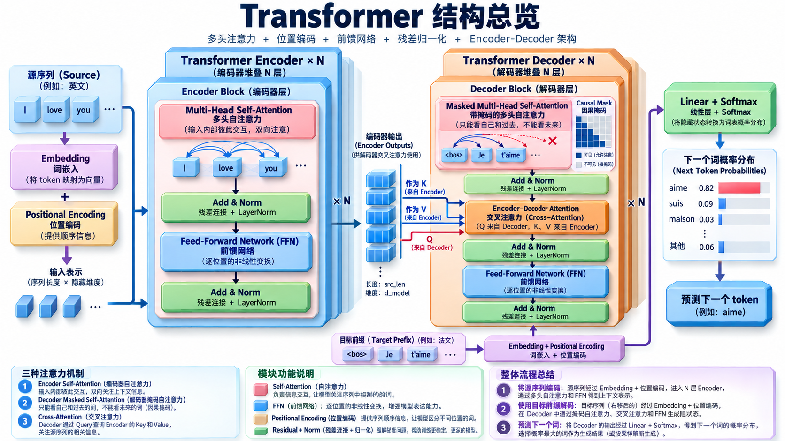

这一节其实是在把你前面学的所有东西“拼起来”。

Transformer 没有什么突然冒出来的新魔法，核心就是：

> 多头注意力 + 自注意力 + 位置编码 + MLP + ResNet 式残差连接，再按 Encoder–Decoder 架构堆起来。

D2L 这一节的 Transformer 仍然是经典“机器翻译版” Encoder–Decoder Transformer。[动手学深度学习](https://zh.d2l.ai/chapter_attention-mechanisms/transformer.html?utm_source=chatgpt.com)

先看全局：

```
源语言：
I love you
   ↓
Embedding + 位置编码
   ↓
┌──────────────────┐
│ Transformer      │
│ Encoder × N      │
└──────────────────┘
   ↓
一整组上下文化表示
   ↓
          ┌──────────────────┐
目标前缀 → │ Transformer      │
          │ Decoder × N      │
          └──────────────────┘
                   ↓
                Linear
                   ↓
                Softmax
                   ↓
              下一个 token
```

最重要的是理解 Encoder 和 Decoder 各自在干什么。

### Encoder：让输入 token 充分互相交流

输入：

```
I   love   you
↓    ↓      ↓
embedding
+
position encoding
```

然后进入一个 Encoder Block。

一个 Block 极简来看就是：

```
X
│
├──────────────┐
↓              │
Multi-Head     │
Self-Attention │
↓              │
+ ←────────────┘   残差
↓
LayerNorm
↓
FFN
│
├──────────────┐
↓              │
输出           │
+ ←────────────┘   残差
↓
LayerNorm
```

所以一个 Encoder Block 就两件事：

```
① Self-Attention：
token 之间互相交换信息

② FFN：
每个 token 自己再加工一下
```

D2L 的 Encoder 每层正是“多头自注意力 + position-wise FFN”，两个子层都配残差连接和 LayerNorm。[动手学深度学习](https://zh.d2l.ai/chapter_attention-mechanisms/transformer.html?utm_source=chatgpt.com)

------

这里 FFN 特别容易被忽略。

假设 Self-Attention 得到：

\[ x_1,x_2,x_3,\dots \]

然后每个 token 独立经过同一个 MLP：

\[ \operatorname{FFN}(x) = W_2\sigma(W_1x+b_1)+b_2 \]

注意：

```
Attention：
token 和 token 之间交流

FFN：
每个 token 自己内部做非线性加工
```

可以粗暴记成：

> Attention 负责“通信”，FFN 负责“思考”。

而且所有位置共享同一套 FFN 参数。D2L 就称它为“基于位置的前馈网络”。[动手学深度学习](https://zh.d2l.ai/chapter_attention-mechanisms/transformer.html?utm_source=chatgpt.com)

------

### 为什么还要残差连接？

就是你学过的 ResNet：

\[ Y=X+\operatorname{Attention}(X) \]

而不是把 \(X\) 完全扔掉。

直觉：

```
旧信息 X
+
Attention 新加工的信息
```

如果新模块暂时没学好，网络仍然可以保留原来的信息。

然后做 LayerNorm。

D2L 这一版写的是：

\[ \operatorname{LayerNorm} \left( X+\operatorname{Sublayer}(X) \right) \]

也就是经典 Transformer 论文里的 Add & Norm。[动手学深度学习](https://zh.d2l.ai/chapter_attention-mechanisms/transformer.html?utm_source=chatgpt.com)

------

### Encoder 堆很多层以后发生什么？

第一层：

```
I      love     you
↔       ↔       ↔
```

每个 token 吸收其他 token 信息。

第二层再在这些“已经上下文化”的表示上继续 Attention：

```
第一层输出
↓
再重新建立关系
↓
第二层输出
↓
...
```

所以最后的每个位置已经不再只是：

```
"I"
```

而更像：

> “‘I’ 在整句话上下文中的表示”。

这和你之前讨论 RNN 的 \(h_t\) 很不一样：它不是必须一步一步把历史压过去。

------

接下来是 Decoder。

### Decoder 比 Encoder 多一个 Attention

一个 Decoder Block 有三个主要模块：

```
目标序列
   ↓
Masked Self-Attention
   ↓
Encoder-Decoder Attention
   ↓
FFN
```

每一个外面同样都有：

```
残差连接 + LayerNorm
```

这是 D2L 里 Decoder Block 的三层结构。[动手学深度学习](https://zh.d2l.ai/chapter_attention-mechanisms/transformer.html?utm_source=chatgpt.com)

第一个叫 Masked Self-Attention。

为什么要 Mask？

训练的时候假设目标句已经全部知道：

```
<bos>  Je  t'  aime  <eos>
```

如果普通 Self-Attention：

```
Je
↓
居然可以看到后面的 aime
```

那就作弊了。

因为真正生成时：

```
<bos>
↓
预测 Je
↓
预测 t'
↓
预测 aime
```

未来词根本还不存在。

所以加一个 causal mask：

```
         可以看
token1 → token1

token2 → token1 token2

token3 → token1 token2 token3

token4 → token1 token2 token3 token4
```

绝对不能：

```
token2 → token3 token4
```

对应 Attention 矩阵大概：

```
        1   2   3   4

1       ✓   ×   ×   ×
2       ✓   ✓   ×   ×
3       ✓   ✓   ✓   ×
4       ✓   ✓   ✓   ✓
```

所以：

> Encoder Self-Attention：大家随便互相看。

> Decoder Self-Attention：只能看自己和过去。

这样就保留了自回归性质。[动手学深度学习](https://zh.d2l.ai/chapter_attention-mechanisms/transformer.html?utm_source=chatgpt.com)

------

然后是整个 Transformer 最值得理解的一步：

### Encoder–Decoder Attention

你已经见过 Bahdanau Attention，所以这里几乎是同一个逻辑。

Decoder 当前表示作为：

\[ Q \]

Encoder 最终输出作为：

\[ K,V \]

所以：

```
Decoder：
“我现在需要什么？”
        ↓
        Q

Encoder 输出：
“I” “love” “you”
 ↓      ↓      ↓
 K/V    K/V    K/V
```

Decoder 去 Encoder 输出里查信息。

例如正在生成：

```
aime
```

Decoder 可能重点关注：

```
love
```

因此这个模块也叫 Cross-Attention（交叉注意力）：

> Q 来自 Decoder，K/V 来自 Encoder。

D2L 明确规定这里 Query 来自 Decoder，Key 和 Value 来自整个 Encoder 输出。[动手学深度学习](https://zh.d2l.ai/chapter_attention-mechanisms/transformer.html?utm_source=chatgpt.com)

于是现在三种 Attention 可以一次性分清：

```
Encoder Self-Attention

Q ← Encoder
K ← Encoder
V ← Encoder
Decoder Masked Self-Attention

Q ← Decoder
K ← Decoder
V ← Decoder

但不能看未来
Cross-Attention

Q ← Decoder
K ← Encoder
V ← Encoder
```

这是这一节最值得记住的结构关系。

------

所以一次 Decoder Block 完整过程：

```
目标词前缀
     ↓
Masked Self-Attention
“我之前已经生成了什么？”
     ↓
Add & Norm
     ↓
Cross-Attention
“根据当前状态，我应该去源句哪里找信息？”
     ↓
Add & Norm
     ↓
FFN
“对得到的信息进一步非线性加工”
     ↓
Add & Norm
```

然后重复 \(N\) 层。

最后：

```
Decoder 最终隐藏表示
        ↓
      Linear
        ↓
目标词表大小的 logits
        ↓
      Softmax
        ↓
下一个 token
```

例如：

```
Je       0.02
suis     0.04
aime     0.87   ←
maison   0.01
...
```

取 `aime`，然后继续生成。

------

现在你可以看到 Transformer 为什么叫 Transformer 了。

它不再像 RNN：

```
h1 → h2 → h3 → h4
```

而是在每一层不断执行：

```
当前所有 token 表示
        ↓
Attention：重新交换/汇聚信息
        ↓
FFN：重新加工表示
        ↓
下一层
```

所以可以把 Transformer 理解成一个反复进行：

> “通信 → 加工 → 通信 → 加工”

的网络。

------

如果把你前面几节串起来，Transformer 的诞生路线非常漂亮：

```
RNN Seq2Seq
↓
整个句子被压进最后一个 h_n
信息瓶颈

↓ Bahdanau Attention

Decoder 可以动态访问
Encoder 的所有 h_t

↓ Self-Attention

既然 Attention 这么好用，
干脆 Encoder 内部 token 之间也直接 Attention

↓ Multi-Head

一次从多个表示子空间建立关系

↓ Positional Encoding

Attention 没天然顺序
→ 把位置信息补进去

↓ ResNet + LayerNorm + FFN

让网络可以稳定地堆得很深

↓
Transformer
```

所以 Transformer 并不是突然蹦出来的一整套神秘结构。

它更像是：

\[ \boxed{ \text{Attention 思想发展到极致之后， 把 RNN 整个拿掉了} } \]

最终你只需要把这张脑图记住：

```
              Transformer

        ┌──── Encoder ────┐

Embedding + Position
        ↓
Self-Attention
        ↓
Add & Norm
        ↓
FFN
        ↓
Add & Norm
        ↓
       × N
        │
        │ K,V
        │
        ↓
   ┌── Decoder ───────────┐

目标 Embedding + Position
        ↓
Masked Self-Attention
        ↓
Add & Norm
        ↓
Cross-Attention ← Encoder
        ↓
Add & Norm
        ↓
FFN
        ↓
Add & Norm
        ↓
       × N
        ↓
Linear + Softmax
        ↓
下一个 token
```

一句话记忆：

> Encoder 用 Self-Attention 把输入“理解透”；Decoder 用 Masked Self-Attention 理解自己已经生成的内容，再用 Cross-Attention 去 Encoder 里取需要的信息，最后预测下一个 token。[动手学深度学习](https://zh.d2l.ai/chapter_attention-mechanisms/transformer.html?utm_source=chatgpt.com)





