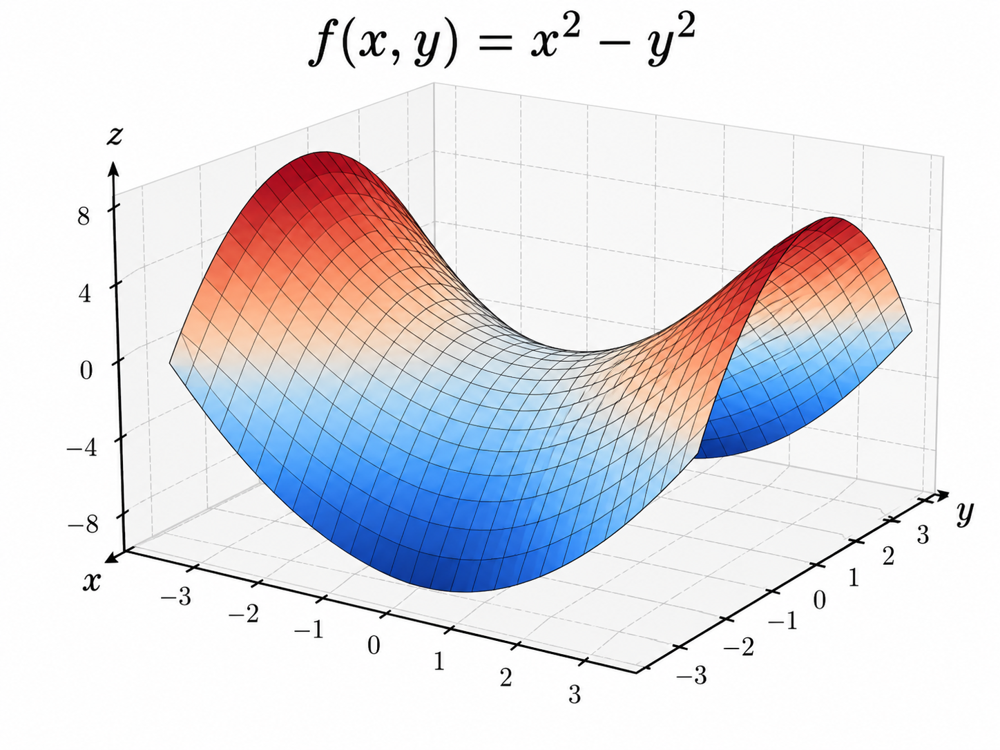

这一节其实是在告诉你：

> 深度学习训练，本质上就是在一个极其复杂的损失函数地形上，想办法把参数往“低处”移动。

但有一个很重要的前提：

> “把训练损失降到最低”和“模型真的学得最好”，不是一回事。 [动手学深度学习](https://zh.d2l.ai/chapter_optimization/optimization-intro.html)

先看最基本的训练过程：

```
参数 θ
 ↓
神经网络
 ↓
预测结果
 ↓
Loss(θ)
 ↓
优化算法
 ↓
调整 θ
 ↓
让 Loss 尽量下降
```

数学上就是：

\[ \min_\theta L(\theta) \]

如果原问题是最大化，也没什么本质区别：

\[ \max f(\theta) \]

可以改成：

\[ \min -f(\theta) \]

所以优化算法通常统一讨论“最小化”。 [动手学深度学习](https://zh.d2l.ai/chapter_optimization/optimization-intro.html)

------

最重要的第一个区别是：

### 优化目标 ≠ 深度学习最终目标

优化算法看到的是：

> 训练集上的 Loss。

也就是所谓经验风险：

\[ \hat R(\theta) = \frac1n\sum_{i=1}^n L(f_\theta(x_i),y_i) \]

但我们真正关心的是：

> 模型以后遇到没见过的数据，表现好不好。

也就是泛化误差 / 真正风险：

\[ R(\theta) = \mathbb E_{(x,y)\sim P} [L(f_\theta(x),y)] \]

问题是，我们不知道整个真实数据分布 \(P\)，手里只有有限训练样本。

所以：

```
真实世界的最佳参数
        ≠
训练集上的最佳参数
```

完全可能：

```
训练 Loss
↓↓↓↓↓↓
非常低

但

测试 Loss
↑↑
反而变差
```

这就是你之前学过的过拟合。D2L 这一节专门强调：优化主要负责降低训练误差，而深度学习最终希望降低泛化误差。 [动手学深度学习](https://zh.d2l.ai/chapter_optimization/optimization-intro.html)

可以把它记成：

> 优化解决“怎么把题做对”；泛化解决“是不是只把答案背下来了”。

------

然后问题来了：

### 深度学习的 Loss 地形根本不是一个漂亮的碗

如果目标函数是：

```
        \      /
         \    /
          \  /
           \/
```

那很好。

沿着梯度一直往下，就能找到最低点。

但神经网络的 Loss 更接近：

```
        /\        ___
   ____/  \__    /   \_
__/         \___/      \__
      \__        __/
         \______/
```

几百万、几十亿维参数共同决定这个地形。

所以优化会遇到几个典型麻烦。

------

### 1. 局部最小值

假设：

```
       \        /
        \__/   /
          ↑   /
       局部最低点

               \____/
                  ↑
               全局最低点
```

局部最小值的意思：

> 我看看附近，自己已经最低了。

但放眼整个参数空间：

> 远处还有更低的位置。

数学上，在某个 \(x^\*\) 附近：

\[ f(x^\*)\leq f(x) \]

但它不一定满足整个空间：

\[ f(x^\*)\leq f(x),\quad \forall x \]

梯度下降走到局部谷底时：

\[ \nabla f\approx0 \]

于是可能觉得：

> 没路可走了。

虽然它并没有达到全局最低点。D2L 还指出，小批量 SGD 自带的梯度噪声有时反而能帮助参数离开某些局部低谷。 [动手学深度学习](https://zh.d2l.ai/chapter_optimization/optimization-intro.html)

------

### 2. 鞍点

这个比局部最小值更值得注意。

典型二维函数：

\[ f(x,y)=x^2-y^2 \]

长这样：

```
一个方向：    \_/
               ↑ 最低

另一个方向：  /\
               ↑ 最高
```

把两个方向组合起来，就是一个“马鞍”。

在中心：

\[ \nabla f=0 \]

但它显然既不是最低点，也不是最高点。

所以：

> 梯度为 0 并不意味着“找到答案”。

可能只是卡在鞍点。 [动手学深度学习](https://zh.d2l.ai/chapter_optimization/optimization-intro.html)

高维空间尤其容易出现这种东西。

假设模型有几百万维参数：

```
方向1：往上
方向2：往下
方向3：往下
方向4：往上
...
```

只要不同方向的曲率有正有负，就是鞍点。

严格一点，用 Hessian：

\[ H=\nabla^2f \]

在梯度为 0 的地方：

```
H 特征值全正 → 局部最小值

H 特征值全负 → 局部最大值

H 特征值有正有负 → 鞍点
```

教材因此指出，在高维非凸问题里，鞍点是非常典型的优化障碍。 [动手学深度学习](https://zh.d2l.ai/chapter_optimization/optimization-intro.html)

------

### 3. 梯度消失

这个你之前已经学过。

优化器更新：

\[ \theta \leftarrow \theta-\eta\nabla L \]

如果：

\[ \nabla L\approx0 \]

那么：

\[ \Delta\theta\approx0 \]

模型基本不动了。

例如：

\[ f(x)=\tanh(x) \]

当 \(x\) 很大时：

```
          ________
        /
      /
____/
```

曲线已经非常平。

因为：

\[ f'(x)=1-\tanh^2(x) \]

例如 \(x=4\) 时导数已经非常接近 0。

所以梯度下降就像：

> 站在一块几乎完全水平的地面上，指南针告诉你“坡度几乎为零”，于是每一步只能挪一点点。

这也是早期 sigmoid/tanh 深层网络难训练、后来 ReLU 等方法变得重要的原因之一。 [动手学深度学习](https://zh.d2l.ai/chapter_optimization/optimization-intro.html)

------

所以这一节真正是在给后面所有优化算法铺路。

为什么后面要学：

```
SGD
Momentum
AdaGrad
RMSProp
Adam
学习率调度
...
```

因为最简单的梯度下降面对的真实地形是：

```
            深度学习 Loss Landscape

局部低谷       鞍点        平坦区
   ↓            ↓           ↓
  \__/        __/\__       ______

        + 高维
        + 非凸
        + 梯度噪声
        + 梯度尺度不一致
```

所以真正的问题不只是：

> “梯度指向哪里？”

而是：

> “面对这么恶劣的地形，怎样沿着梯度更快、更稳定地走？”

这就是接下来整个优化章节要回答的问题。 [动手学深度学习](https://zh.d2l.ai/chapter_optimization/optimization-intro.html)

最后把这一节压成一条逻辑链：

```
神经网络训练
↓
定义 Loss
↓
优化器降低训练 Loss
↓
但训练 Loss 最低
≠ 泛化最好

同时 Loss 地形非凸
↓
会遇到：

局部最小值
鞍点
梯度消失
↓
普通梯度下降不够好
↓
需要更强的优化算法
```

一句话记忆：

> 优化就是在高维 Loss 地形里找低处；深度学习真正麻烦的地方，是这片地形坑多、鞍点多、还有大片几乎没坡度的区域，而且“训练集最低点”还未必是“真实世界最好点”。


